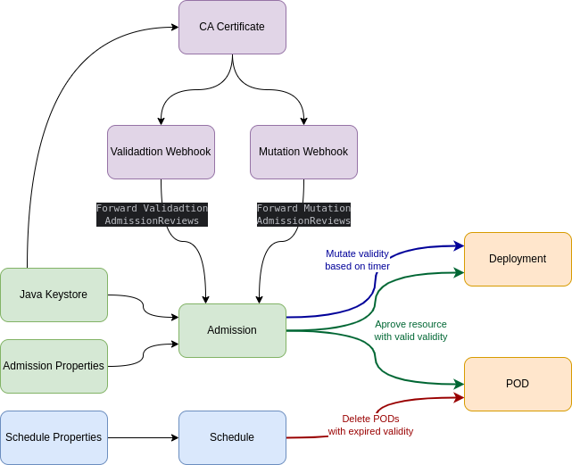

# Author
* Alexandre D´Amato 
  * [LinkedIn](https://www.linkedin.com/in/alexandre-nogueira-d-amato-gomes-65750283/)
  * [Wiki](https://wiki.clusterlab.com.br)
  * [Medium TimeBomb](https://medium.com/cloud-native-daily/reduce-your-kubernetes-cost-with-the-time-bomb-solution-21bc918d1309)

# TimeBomb

TimeBomb does what the name suggests. You can add a timer to explode something. In this case, it'll "explode" Kubernetes PODs.


The TimeBomb solution is a Spring Boot app that relies on [Kubernetes Dynamic Admission Control](https://kubernetes.io/docs/reference/access-authn-authz/extensible-admission-controllers/) to add validity to PODs, based on a timer annotation, and prevent expired PODs to be deployed, with expired validity.


When you deploy an app in a Kubernetes cluster, TimeBomb will read a timer annotation and sum this timer to the current time to create validity. If you add a timer of 15 minutes, the validity of the current time + 15 minutes will be added to the deployment as an annotation. This process is done using a "mutation webhook".


Deployments and PODs will only be created if they are considered valid. An [EPOCH](https://en.wikipedia.org/wiki/Epoch) number greater than the current EPOCH.


After a POD expires, if its EPOCH is less than the current time, the scheduler deletes the POD and the ReplicaSet cannot deploy new PODs with expired validity.


You can warm up the app again by two methods.


1. Redeploy your app, so the mutation process can calculate a new validity based on the timer.
2. Do a JsonPatch on the resource by extending the validity annotation.


---

## Applicability


In a cloud environment, a Kubernetes cluster is a bunch of computers.


Those computers are called "nodes" and the growth of the cluster is pushed by the increase in the number of PODs running.
Thus, the growth of PODs forces the increase in the number of nodes. And you are charged by the cloud provider by the amount of computing, CPU, that is consumed. TimeBomb will reduce the PODs running, so it can reduce the number of nodes.


### Proof of Concept


TimeBomb is great for POC where you may try a new tool/solution and don't want to forget to remove it from your test cluster.


With TimeBomb it will happen automatically. TimeBomb will delete it for you after the timer expires.


### Development and test environment


You may have different environments for each purpose in software development, quality assurance, tests, and security.


After an application has passed security tests, unit testings and has been deployed in a quality assurance cluster, this app may not be required anymore to run on a development cluster or any other intermediate environment. With TimeBomb you can remove the app PODs to reduce infrastructure cost.


You may have a similar scenario for an app that is not in active development and wishes that this app become unprovisioned after few days from non-productive environments.


TimeBomb will keep your footprint small in your cluster.


### DR - Disaster Recovery


You may have a disaster recovery cluster but do not want to keep all apps running there, but at the same time wishes to run all apps there for an amount of time to validate connectivity and functionality.


TimeBomb will remove all apps' PODs from the cluster after the expiration of the validity.
You can warm up all PODs in a cluster using a simple command of JsonPatch with kubectl to extend the validity. This command is offered here with the solution and explained in the section "Extend Validity".


---


## Architecture


---

## Installation

### HELM Values
Example of [values.yaml](https://github.com/kubeomatic/k8s-timebomb/blob/main/helm-chart/kubeomatic-timebomb/values.yaml):
```yaml
admission:
  # imageTag: latest
  spec:
    replicas: 2
  config: |-
    server.port=8443
    logging.level.root=INFO
    management.endpoint.health.probes.enabled=true
  selector:
    # This label will be used to match events from the namespace.
    # Only namespaces with the label below and with one of the values below will have their operations intercepted by the kubernetes api for mutation/validation admission control.
    label: "kubeomatic-io-timebomb-cluster"
    values: ["dev-all","dev-02"]
  
schedule:
  # imageTag: latest
  spec:
    # Recommended number of replicas for the schedule is 1, one. Otherwise, you may have two PODs hitting the kubernetes API at the same time to delete PODs.
    replicas: 1
  config: |-
    server.port=8080
    logging.level.root=INFO
    management.endpoint.health.probes.enabled=true
    # The values below are used to search expired PODs. they need to match the selector from admission.
    kubeomatic-io.timebomb.label.selector.value=dev-02;dev-all
    # This cron expression has 6, six, values. The left one is for seconds. In this example schedule will search for expired PODs every 15 seconds.
    cron.expression= */15 * * * * *
certificate:
  rootCaCert: "" # Should be left empty if using CLI to load values
  keyStore: "" # Should be left empty if using CLI to load values
  keyStorePAss: "abcabc" # Keystore secret
common:
  name: "timebomb"
  nameSpace: "timebomb"
  registry: "registry.hub.docker.com"
  repository: "kubeomatic/"
  image: "timebomb"
  imageTag: "0.424"
  labels: {}
```
### Certificate


Kubernetes will send AdmissionReviews to the admission app only using TLS.


So, a [CA, Certificate authority,](https://en.wikipedia.org/wiki/Certificate_authority) with a certificate needs to be emitted. This can be done using a self-signed certificate.


ValidatingWebhookConfiguration and MutatingWebhookConfiguration must know the CA used to sign the certificate and the certificate needs to match the [DNS for Services](https://kubernetes.io/docs/concepts/services-networking/dns-pod-service/) on the cluster.


For that, there is a script that can be used to generate the Certificate authority, certificate, and java keystore.


This [script](https://github.com/kubeomatic/k8s-timebomb/blob/main/helm-chart/kubeomatic-timebomb/certificate_generator.sh) will read the information in the values.yaml from the helm chart.


### How to Install


1. Edit the values for the helm chart: [values.yaml](https://github.com/kubeomatic/k8s-timebomb/blob/main/helm-chart/kubeomatic-timebomb/values.yaml)
2. Add the [TimeBomb](https://helmchart.kubeomatic.io/timebomb/) helm repository.
3. Generate a keystore with a certificate. The certificate's common name is dependable on the resource DNS name. Example: service.namespace.svc.cluster.local. To easily generate the certificate you may use this [script](https://github.com/kubeomatic/k8s-timebomb/blob/main/helm-chart/kubeomatic-timebomb/certificate_generator.sh) which reads the values.yaml.
4. Create the namespace in the cluster Kubernetes for the solution.
5. Install solution via helm.


```shell
$ ./certificate_generator.sh values.yaml
$ kubectl create namespace timebomb
$ helm upgrade \
    --install \
    -n timebomb timebomb \
    -f values.yaml \
    --set "certificate.rootCaCert=$(cat tmp/rootCA.crt |base64 -w0),certificate.keyStore=$(cat tmp/ks.p12|base64 -w0)" \
    --version 0.1.4 \
    timebomb/kubeomatic-timebomb
```
---
## How to Set up an App
This topic will not cover label and annotation customization.

Example of a simple NGINX deployment:
```yaml
apiVersion: v1
kind: Namespace
metadata:
  name: nginx
  labels:
    kubeomatic-io-timebomb: "enabled"
    kubeomatic-io-timebomb-cluster: "dev-all"
---
apiVersion: apps/v1
kind: Deployment
metadata:
  name: nginx-deployment
  namespace: nginx
  labels:
    app: nginx
    kubeomatic-io-timebomb: "enabled"
    kubeomatic-io-timebomb-cluster: "dev-all"
spec:
  replicas: 8
  selector:
    matchLabels:
      app: nginx
  template:
    metadata:
      labels:
        app: nginx
        kubeomatic-io-timebomb: "enabled"
        kubeomatic-io-timebomb-cluster: "dev-all"
      annotations:
        kubeomatic-io-timebomb-timer: "1m"
        kubeomatic-io-timebomb-sku: "/grandfather/father/son"
    spec:
      containers:
        - name: nginx
          image: nginx:1.14.2
          ports:
            - containerPort: 80

```
### NameSpace Labels
For the solution to work the namespace needs to have a label that matches the selector used to deploy TimeBomb.


ValidatingWebhookConfiguration and MutatingWebhookConfiguration use this label to tell Kubernetes API which namespaces will have their requests, AdmissionReviews, sent to the TimeBomb solution.


In the example below the matching label is "kubeomatic-io-timebomb-cluster" with the value "dev-all". So, if you have two development clusters and both clusters have the TimeBomb solution you can specify in each cluster your app will be "exploded". At dev-01, dev-02, or dev-all.
```yaml
kubeomatic-io-timebomb-cluster: "dev-all"
```
The label below is used by the app to check if the solution is active.


This label provides an extra layer of protection to avoid unwanted deletion of PODs.
```yaml
kubeomatic-io-timebomb: "enabled"
```


### Deployments Labels


Deployments have the same labels a nameSpace does in its labels and at template labels.


This is done to propagate the labels to the PODs.


```yaml
metadata:
  labels:
    kubeomatic-io-timebomb: "enabled"
    kubeomatic-io-timebomb-cluster: "dev-all"
spec:
  template:
    metadata:
      labels:
        kubeomatic-io-timebomb: "enabled"
        kubeomatic-io-timebomb-cluster: "dev-all"
```

### Deployments Template Annotations
```yaml
spec:
  template:
    metadata:
      annotations:
        kubeomatic-io-timebomb-timer: "1m"
        kubeomatic-io-timebomb-sku: "/grandfather/father/son"
```

"kubeomatic-io-timebomb-timer" is the only required annotation. It's used to set the timer. 

Valid suffixes are s(for seconds), m(for minutes), h(for hours) and d(for days):

Example:
```yaml
kubeomatic-io-timebomb-timer: "86400s"
# or
kubeomatic-io-timebomb-timer: "1440m"
# or
kubeomatic-io-timebomb-timer: "24h"
# or
kubeomatic-io-timebomb-timer: "1d"
```

"kubeomatic-io-timebomb-sku" is an optional annotation that is useful with the "Extend Validity" script, where you can warm up all your pods that match the entire SKU expression or part of it.


Example:
```shell
# Will change the validity of an App that matches SKU "/tribe/squad/app" to 60 minutes
$ TIMEBOMB EXTEND_TIMEBOMB_VALIDITY_BY_SKU "/tribe/squad/app" 60


# Will change the validity of all Apps in the squad "/tribe/squad" to 60 minutes
$ TIMEBOMB EXTEND_TIMEBOMB_VALIDITY_BY_SKU "/tribe/squad" 60


# Will change the validity of all Apps in the tribe "/tribe" to 60 minutes
$ TIMEBOMB EXTEND_TIMEBOMB_VALIDITY_BY_SKU "/tribe" 60


# Will change the validity of all Apps in the cluster "/" to 60 minutes
$ TIMEBOMB EXTEND_TIMEBOMB_VALIDITY_BY_SKU "/" 60
```
### Deployment Final State
During the mutation phase, the admission app will read the timer and add validity.


It'll add "kubeomatic-io-timebomb-valid". An annotation with the EPOCH number when the POD should be deleted.


The annotation "kubeomatic-io-timebomb-valid-human" will be added only to make it easy to read the expiration date of the resource.


```yaml
spec:
  template:
    metadata:
      annotations:
        kubeomatic-io-timebomb-timer: "1h"
        kubeomatic-io-timebomb-sku: "/grandfather/father/son"
        kubeomatic-io-timebomb-valid: "1682287397"
        kubeomatic-io-timebomb-valid-human: Wed Apr 19 22:21:05 GMT 2023
```

Note that you should not specify "kubeomatic-io-timebomb-valid" or "kubeomatic-io-timebomb-valid-human" on your deployment manifest. Those labels are added on the fly by the mutation phase.

***


## Extend Validity
After the PODs expire and are deleted, all other resources remain in the cluster.


Below is an NGINX namespace with expired validity.


There are no PODs running.


```shell
$ kubectl -n nginx get all
NAME                               READY   UP-TO-DATE   AVAILABLE   AGE
deployment.apps/nginx-deployment   0/8     0            0           3d22h

NAME                                          DESIRED   CURRENT   READY   AGE
replicaset.apps/nginx-deployment-6598d88757   8         0         0       3d22h
```

To extend the validity all you have to do is a kubectl command patching the validity annotation.
```shell
$ export TIMER=90 # 90 minutes

$ export EPOCH=$(expr $(date +"%s") + $(expr 60 \* $TIMER ) )

$ kubectl -n nginx patch deployment nginx-deployment \
  --type='json' \
  -p='[ {"op": "replace", "path": "/spec/template/metadata/annotations/kubeomatic-io-timebomb-valid", "value":"'$EPOCH'"}]'
  
deployment.apps/nginx-deployment patched

$ kubectl -n nginx get all
NAME                                   READY   STATUS    RESTARTS   AGE
pod/nginx-deployment-fc8ff7b68-7k65n   1/1     Running   0          57s
pod/nginx-deployment-fc8ff7b68-jqsbw   1/1     Running   0          55s
pod/nginx-deployment-fc8ff7b68-k4smw   1/1     Running   0          58s
pod/nginx-deployment-fc8ff7b68-m8lgm   1/1     Running   0          58s
pod/nginx-deployment-fc8ff7b68-mbhdt   1/1     Running   0          58s
pod/nginx-deployment-fc8ff7b68-sgm2w   1/1     Running   0          55s
pod/nginx-deployment-fc8ff7b68-x5498   1/1     Running   0          56s
pod/nginx-deployment-fc8ff7b68-xlffk   1/1     Running   0          58s

NAME                               READY   UP-TO-DATE   AVAILABLE   AGE
deployment.apps/nginx-deployment   8/8     8            8           3d22h

NAME                                          DESIRED   CURRENT   READY   AGE
replicaset.apps/nginx-deployment-6598d88757   0         0         0       3d22h
replicaset.apps/nginx-deployment-fc8ff7b68    8         8         8       58s
```
You may find a scenario where the ReplicaSet still reflects the old validity annotation. In this case, you may have to delete the outdated ReplicaSet definition.


To make things easier, there is a [script](https://github.com/kubeomatic/k8s-timebomb/blob/main/tools/extend-timer-bash/run.sh) that may help you with those operations. Especially in large-scale cluster.


This script is ideal to use with [RUNDECK](https://www.rundeck.com/) or other automation solutions.


